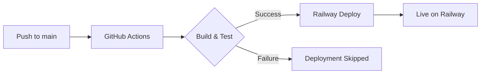

# Lucy WCAG - Railway CI/CD Setup

Production-ready WCAG scanner with ADHD-friendly batching, overlays, email factory, connectors, and CLI.

## 🚀 Automated Deployment to Railway

This repository is configured with automated CI/CD for seamless deployments to Railway.

### Setup Complete ✅

The following automation is already configured:

#### 1. **GitHub Actions Workflow** (`.github/workflows/main.yml`)
- ✅ Runs on every push to `main` branch
- ✅ Installs dependencies using `npm ci`
- ✅ Builds the application using `npm run build`
- ✅ Runs linter and tests (if available)
- ✅ Uploads build artifacts

#### 2. **Railway Configuration**
- ✅ Connected to GitHub repository
- ✅ Build command: `npm run build`
- ✅ Start command: `npx serve -s dist -l 3000`
- ✅ Wait for CI enabled (deploys only after GitHub Actions pass)
- ✅ Public domain: [lucy-wcag-production.up.railway.app](https://lucy-wcag-production.up.railway.app)
- ✅ Port: 3000

### 🔄 CI/CD Workflow



### 📋 Deployment Process

1. **Commit & Push** to the `main` branch
2. **GitHub Actions** automatically runs:
   - Checks out code
   - Sets up Node.js 20
   - Installs dependencies with `npm ci`
   - Builds the Vite/React app
   - Runs linter and tests
3. **Railway** waits for CI to pass
4. **Automatic Deployment** to production

### 🛠️ Next Steps to Complete Setup

**Add your Vite/React application files:**

```bash
# Clone the repository
git clone https://github.com/aaj441/lucy-wcag.git
cd lucy-wcag

# Add your Vite/React app files
# Make sure you have:
# - package.json with dependencies
# - package-lock.json
# - src/ directory with your React code
# - vite.config.js
# - index.html

# Commit and push
git add .
git commit -m "Add lucy-wcag application source code"
git push origin main
```

### 📦 Required Files

Your repository needs these files for the build to succeed:

- `package.json` - Dependencies and scripts
- `package-lock.json` - Locked dependency versions
- `vite.config.js` - Vite configuration
- `index.html` - HTML entry point
- `src/` - React source code

### 🔧 Build Configuration

**package.json scripts should include:**
```json
{
  "scripts": {
    "dev": "vite",
    "build": "vite build",
    "lint": "eslint . --ext js,jsx --report-unused-disable-directives --max-warnings 0",
    "preview": "vite preview"
  }
}
```

### 🌐 Environment Variables

To add environment variables in Railway:
1. Go to your Railway project
2. Click on the lucy-wcag service
3. Navigate to **Variables** tab
4. Add your environment variables

### 📊 Monitoring

- **GitHub Actions**: [View workflow runs](https://github.com/aaj441/lucy-wcag/actions)
- **Railway Dashboard**: [View deployments](https://railway.com/project/fbe961f3-e59e-4e75-b466-8f91a69dc954/service/44d212c3-1dd2-4a8b-a96c-5477c351302c)
- **Production URL**: https://lucy-wcag-production.up.railway.app

### 🔐 Security Notes

- Railway automatically uses HTTPS for all deployments
- Environment variables are encrypted
- GitHub Actions workflow runs in isolated containers
- Minimal manual setup required

### 🐛 Troubleshooting

**Build fails?**
- Check GitHub Actions logs for error details
- Ensure `package-lock.json` is committed
- Verify all dependencies are listed in `package.json`

**Deployment skipped?**
- Railway waits for CI to pass
- Check GitHub Actions status first
- Fix any CI failures and push again

**App not loading?**
- Verify the build outputs to `dist/` directory
- Check Railway deployment logs
- Ensure port 3000 is correctly configured

### 📝 License

This project is licensed under the terms included in the LICENSE file.
